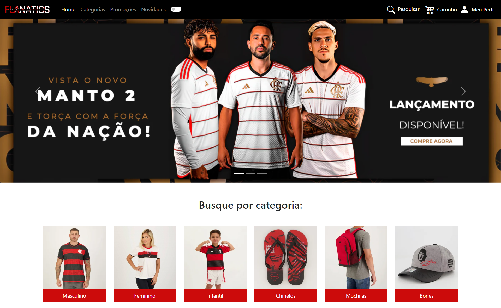

# FlaNatics - Sua Loja Oficial do Mengão!

Bem-vindo ao FlaNatics, sua loja oficial do Flamengo! Seja você um torcedor apaixonado ou apenas um admirador do Mengão, temos tudo o que você precisa para mostrar seu amor pelo clube mais querido do Brasil.

## Captura de Tela

## Tecnologias Utilizadas

- **HTML5:** Para estruturação da página web.
- **CSS3:** Para estilização e design responsivo.
- **Bootstrap 5:** Framework front-end para um design responsivo e atraente.
- **JavaScript:** Adiciona interatividade e dinamismo ao site

## Recursos Especiais

- **Navegação Intuitiva:** Uma experiência de usuário fluida com navegação fácil para encontrar seus produtos favoritos.
- **Modo Noturno:** Ative o modo noturno para uma experiência de compra mais confortável em ambientes com pouca luz.
- **Pesquisa Rápida:** Encontre rapidamente o que você precisa com nossa barra de pesquisa integrada.

## Como Visualizar o Site

Você pode acessar meu site pessoal [clicando aqui](https://flanatics.vercel.app/).

## Como Contribuir

Se você deseja contribuir para o desenvolvimento do **FlaNatics**, sinta-se à vontade para fazer um fork deste repositório. Você pode sugerir melhorias, corrigir bugs ou adicionar novos recursos. Estou sempre aberto a colaborações construtivas.

## Licença

Este projeto é licenciado sob a Licença MIT - veja o arquivo [LICENSE](LICENSE) para detalhes.

## Autor

Desenvolvido por Gabriel Rios.

---

Espero que você goste de navegar no FlaNatics tanto quanto gostei de criar este espaço para os fãs do Flamengo. Vá em frente, explore, e vista o manto com orgulho! 🔴⚫️
